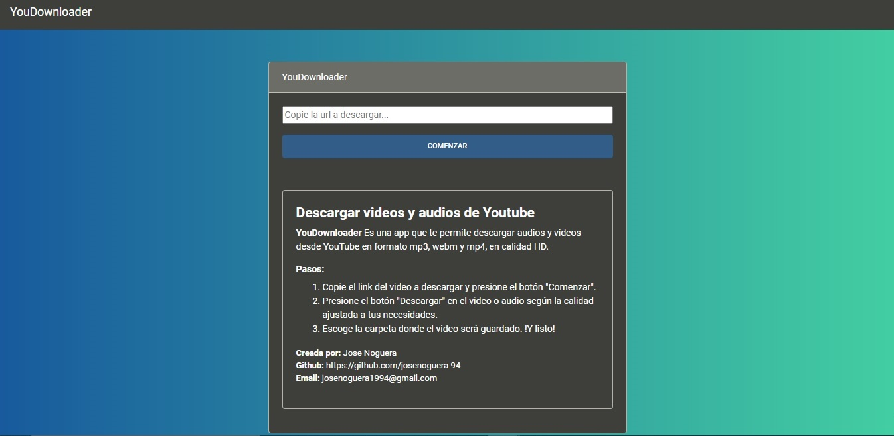
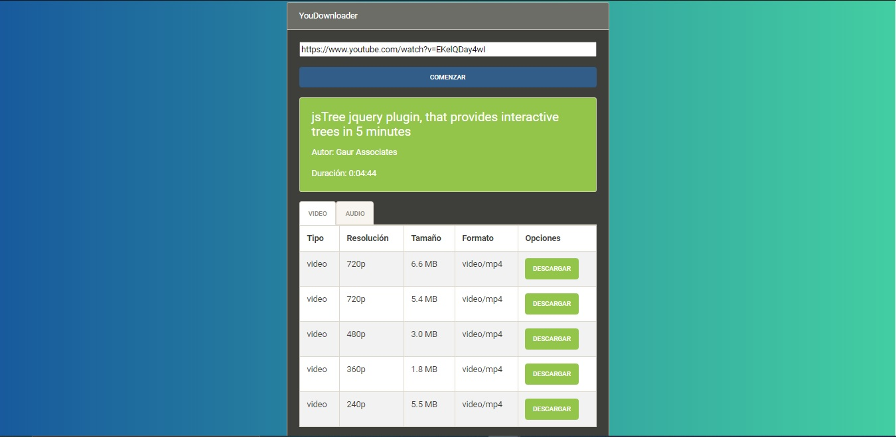
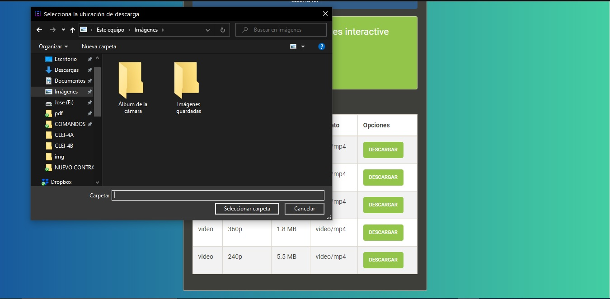
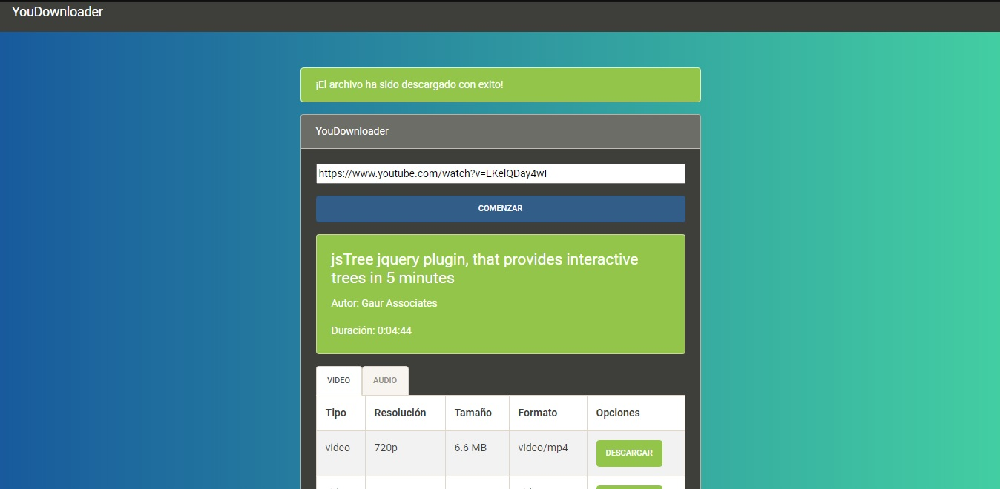
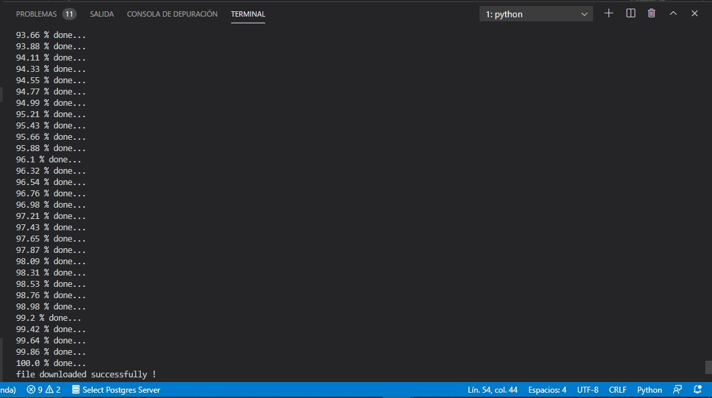

# **YouDownloader**

 Es una app echa en flask que te permite descargar audios y videos desde YouTube en formato mp3, webm y mp4, en calidad HD.

 ###  **Librerías:**
~~~
pytube==14.4.1
flask==1.1.2
~~~

 ### **Pasos:** 

 1. Copie el link del video a descargar y presione el botón "**Comenzar**".
 2. Presione el botón "**Descargar**" en el video o audio según la calidad ajustada a tus necesidades.
 3. Escoge la carpeta donde el video será guardado. !Y listo!

**Creada por:** Jose Noguera

## **Imágenes del proyecto**

¡Buena suerte!
